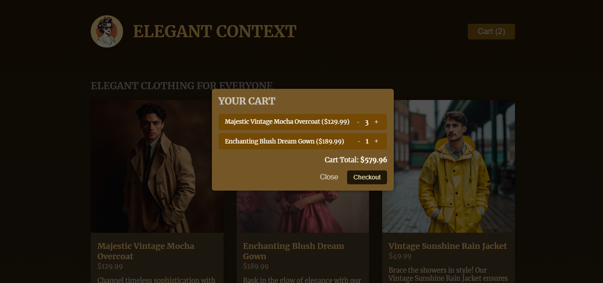

# React Reaction Timer

[](https://react.dev/)


This project is a simple yet powerful Virtual Store application built with **React**. It features a dynamic shopping cart powered by the **Context API** and the `useReducer` hook, allowing users to add products to their cart, adjust quantities, and view the cart total in real-time.

## Project Overview

### Overview


### Cart



## Features

- **Product Listing:** Browse a variety of products dynamically loaded from a mock dataset.
- **Add to Cart:** Easily add items to the shopping cart.
- **Update Cart:** Modify the quantity of items in the cart or remove them entirely.
- **Cart Context:** Manage cart state globally using React's Context API.
- **Efficient State Updates:** Utilize the `useReducer` hook for scalable state management.
- **Real-Time Cart Updates:** Instant UI updates reflecting the cart's current state

## How It Works

1. State Management:

- The shopping cart state is managed using a useReducer function, which listens for specific action types like **ADD_ITEM** and **UPDATE_ITEM**.
- The Context API provides global access to the cart's state and dispatch functions.

2. Adding Items to Cart:

- When a user clicks the "Add to Cart" button, the **ADD_ITEM** action checks if the item exists in the cart.
- If it does, its quantity is incremented; otherwise, the item is added with a default quantity of 1.

3. Updating Quantities:

- The **UPDATE_ITEM** action allows users to increase or decrease the quantity of an item or remove it entirely when the quantity reaches zero.

4. Product Data:

- The app uses a mock dataset **(DUMMY_PRODUCTS)** for listing available products..

## Project Structure

```
Elegant-Context
│
│      .gitignore
│      .vite.config
│      index.html
│      package-lock.json
│      package.json
│      README.md
│
│
└───public
│   Cart.png
│   logo.png
│   OverView.png
│
└───src
    │   App.jsx
    │   index.jsx
    │   dummy-products.js
    │   index.css
    │
    ├───assets
    │       denim-pioneer.jpg
    │       dream-gown.jpg
    │       merlot-suit.jpg
    │       mocha-overcoat.jpg
    │       moonlight-dress.jpg
    │       rain-jacket.jpg
    │
    ├───components
    │      Cart.jsx
    │      CartModal.jsx
    │      Header.jsx
    │      Product.jsx
    │      Shop.jsx
    │
    ├─── store
    │      shopping-cart-context.jsx
    │
```

## Installation

To get started with the project locally:

1. Clone the repository:
   ```bash
   git clone https://github.com/SalahShallapy/Elegant-Context.git
   ```
2. Navigate to the project directory:
   ```bash
   cd Elegant-Context
   ```
3. Install dependencies:
   ```bash
   npm install
   ```
4. Run the project:

   ```bash
   npm run dev
   ```

## Contributing

Contributions are what make the open source community such an amazing place to learn, inspire, and create. Any contributions you make are **greatly appreciated**.

If you have a suggestion that would make this better, please fork the repo and create a pull request. You can also simply open an issue with the tag "enhancement".
Don't forget to give the project a star! Thanks!

1.  Fork the Project
2.  Create your Feature Branch (`git checkout -b feature/AmazingFeature`)
3.  Commit your Changes (`git commit -m 'Add some AmazingFeature'`)
4.  Push to the Branch (`git push origin feature/AmazingFeature`)
5.  Open a Pull Request

   <p align="right">(<a href="#top">back to top</a>)</p>
